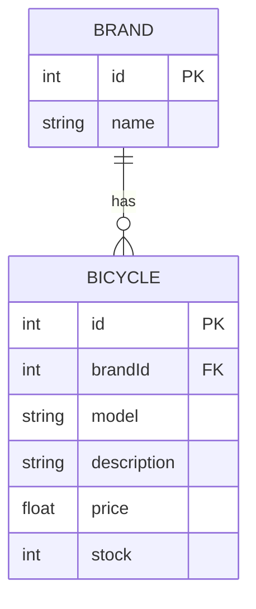

## Diagrama de Entidad-Relación (ERD) Brand 1:N Bicycle

```mermaid
erDiagram
    BRAND ||--o{ BICYCLE : has

    BRAND {
        int id PK
        string name
    }

    BICYCLE {
        int id PK
        int brandId FK
        string model
        string description
        float price
        int stock
    }
```