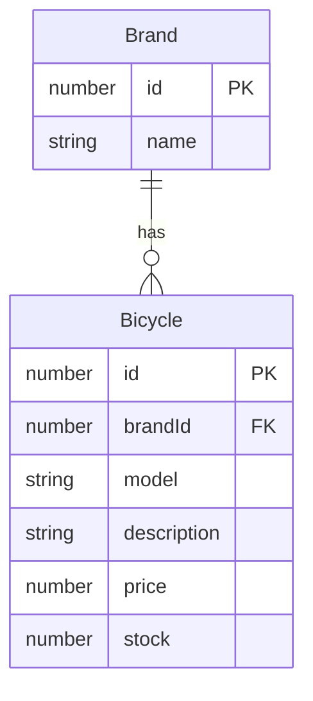

## Diagrama de Entidad-Relación (ERD) Bicycle 1:N Brand

```mermaid
erDiagram
    Brand ||--o{ Bicycle : has

    Brand {
        number id PK
        string name
    }

    Bicycle {
        number id PK
        number brandId FK
        string model
        string description
        number price
        number stock
    }
```